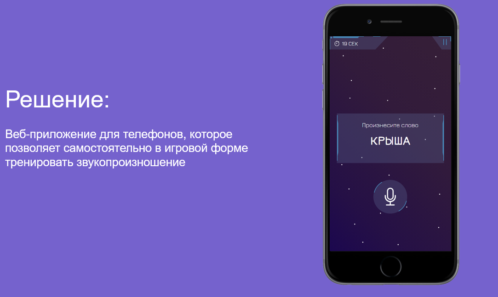

# Приложение для тренировки произношения слов пациентам с дизартрией

Приложение использует принципы игрофикации для поддержания регулярных тренировок и мотивации пациентов.

Приложение разработана на ["Хакатоне по Медицинскому ИИ"](https://habr.com/ru/company/ashmanov_net/blog/595865/), проект занял второе место.

Автор - Попов Виталий (команда TrueWay).

## Концепция

Пациенты играют за космонавта, который путешестует по планетам и тренируют своё произношение. Пациенту необходимо произносить слова или слоги, которые пишутся на экране, за это ему добавляется время и игровые очки. Каждая планета состоит из нескольких заданий. После прохождения планеты, новая открывается через день.

## Программная реализация и используемые изображения

Данный проект написан на JS с использованием библиотеки WebkitSpeechRecognition, большая часть картинок нарисована самостоятельно, планеты и некоторые объекты взяты с itch.io под лицензией "КАК ЕСТЬ"

## Скриншоты

